<div align="center">

# Explainable Artificial Intelligence in Medical Systems

### From Black Box Models to Reliable Clinical Decision Support

**IEEE CARS 2026 Workshop**<br>
Organised by the Center for Cyber Security Research (C2SR), University of North Dakota<br>
Grand Forks, ND, USA · 28 October 2026 · 2 hours, online session

<a href="https://colab.research.google.com/github/utkukose/xai-cars2026-NB-workshop/blob/main/notebooks/NB1_Black_Box_Problem.ipynb"></a>
&nbsp;&nbsp;
<a href="https://utkukose.github.io/xai-cars2026-NB-workshop/"></a>

[](https://ieee-cars.org/program/workshops/workshop-explainable-artificial-intelligence-in-m)
[](https://engineering.und.edu/research/cyber-security/)
[](https://engineering.und.edu/research/cyber-security/cars.html)
[](https://www.python.org/)
[](https://github.com/utkukose/xai-cars2026-NB-workshop/actions/workflows/notebooks.yml)
[](https://creativecommons.org/licenses/by-nc-sa/4.0/)

**Prof. Dr. Utku Köse**<br>
Department of Computer Engineering, Süleyman Demirel University, Isparta, Türkiye<br>
Director, Artificial Intelligence Application and Research Center (YAZEM), Süleyman Demirel University<br>
University of North Dakota, Grand Forks, USA<br>
Universidad Panamericana, Mexico City, Mexico<br>
Vel Tech University, Chennai, India<br>
IEEE Senior Member · ACM Professional Member

[](https://orcid.org/0000-0002-9652-6415)
[](https://www.utkukose.com)
[](https://github.com/utkukose)

</div>

---

<p align="center">
<a href="https://utkukose.github.io/xai-cars2026-NB-workshop/#spoof">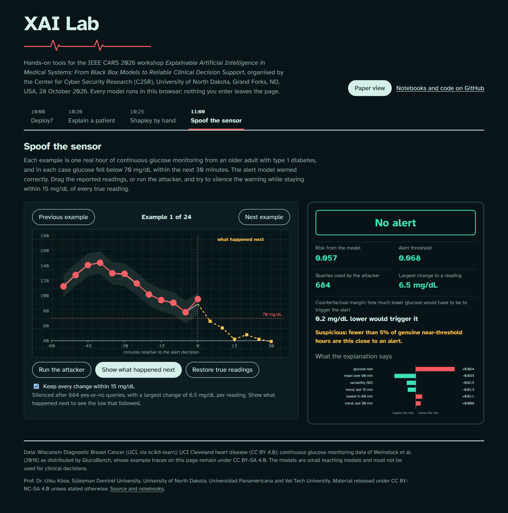</a><br>
<sub>The <em>Spoof the sensor</em> tab of the XAI Lab. Real CGM readings are nudged by at most 6.5 mg/dL, the correct hypoglycaemia alert falls silent, and the counterfactual margin flags the silence as suspicious. The dashed trace shows the low that followed.</sub>
</p>

## About

This repository contains the complete material of the two-hour workshop *Explainable Artificial Intelligence in Medical Systems: From Black Box Models to Reliable Clinical Decision Support*. The workshop takes place on 28 October 2026, the third day of the IEEE Cyber Awareness and Research Symposium (IEEE CARS 2026), which is organised by the [Center for Cyber Security Research (C2SR)](https://engineering.und.edu/research/cyber-security/) of the University of North Dakota in Grand Forks, North Dakota, USA. The session itself is delivered online.

The workshop starts from a diagnostic model that looks ready for the clinic, opens it with more than twenty explanation methods, attacks three medical AI systems in ways that no validation metric notices, and shows how explanations make those attacks observable. It closes with the governance artefacts that regulators and hospital committees ask for.

The material has three layers. Seven Colab notebooks carry the full analysis with runnable Python code. The browser-based XAI Lab lets participants experiment during the session without installing anything. A Streamlit dashboard shows how explanations reach a clinician. Every dataset is real, openly accessible and downloaded by the notebooks themselves; no simulated patient data are used anywhere.

## Programme

| Time | Part | What happens | Material |
|---|---|---|---|
| 10:00–10:20 | The black box problem | A model with 97 percent accuracy, its missed cancers, its confident errors and a shortcut it learned; the EU AI Act, FDA and GDPR mandates | NB1 · Lab: *Deploy?* |
| 10:20–10:45 | The XAI toolkit | Glass-box models, global and local attribution, contrastive and rule-based explanations, Grad-CAM on real chest X-rays, GEMEX, and the evaluation of explanations | NB2 · NB3 · Lab: *Explain a patient*, *Shapley by hand* |
| 10:45–11:00 | Break | | |
| 11:00–11:30 | Attacks and XAI-based analysis | Silencing CGM hypoglycaemia alerts, delaying ICU sepsis alerts, hiding atrial fibrillation from a wearable; SHAP anomaly scores, counterfactual margins, GEMEX geometry and Page-Hinkley monitoring | NB4 · NB5 · NB6 · Lab: *Spoof the sensor* |
| 11:30–11:50 | Governance and the dashboard | Risk classification under the EU AI Act, a subgroup audit with uncertainty, a model card, the clinician dashboard | NB7 · `dashboard/` |
| 11:50–12:00 | Questions and discussion | | |

The session plan with timings, polls and a fallback plan is in [WORKSHOP_GUIDE.md](WORKSHOP_GUIDE.md).

## Notebooks

Each button opens the notebook in Google Colab. The first cell installs any missing package, the data are downloaded into a local `workshop_data/` folder, and every notebook runs on a free Colab CPU in one to six minutes. NB3 is faster with a GPU runtime.

| Notebook | Question | Data | Methods |
|---|---|---|---|
| **NB1 · The Black Box Problem**<br><br><a href="https://colab.research.google.com/github/utkukose/xai-cars2026-NB-workshop/blob/main/notebooks/NB1_Black_Box_Problem.ipynb"></a> | What does a 97 percent accuracy figure hide? | Wisconsin Diagnostic Breast Cancer | out-of-fold evaluation, threshold trade-offs, confident errors, calibration, shortcut learning |
| **NB2 · XAI Toolkit I: Tabular**<br><br><a href="https://colab.research.google.com/github/utkukose/xai-cars2026-NB-workshop/blob/main/notebooks/NB2_XAI_Toolkit_Tabular.ipynb"></a> | Which method answers which question, and can its answer be trusted? | UCI Cleveland heart disease | logistic regression, tree, spline GAM, EBM, permutation importance, SHAP, PDP and ICE, ALE, SAGE, LIME, MAPLE, integrated gradients, counterfactuals, Anchors, global surrogate, GEMEX, faithfulness, monotonicity, stability, disagreement |
| **NB3 · XAI Toolkit II: Imaging**<br><br><a href="https://colab.research.google.com/github/utkukose/xai-cars2026-NB-workshop/blob/main/notebooks/NB3_XAI_Toolkit_Imaging.ipynb"></a> | Do heat maps explain the model or the image? | PneumoniaMNIST (MedMNIST v2) | CNN, Grad-CAM, gradients, SmoothGrad, integrated gradients, occlusion, cascading randomisation, deletion test, FGSM |
| **NB4 · Attack 1: CGM hypoglycaemia alerts**<br><br><a href="https://colab.research.google.com/github/utkukose/xai-cars2026-NB-workshop/blob/main/notebooks/NB4_Attack_CGM_Hypoglycemia.ipynb"></a> | Can a correct low-glucose alert be silenced within sensor error? | Weinstock et al. type 1 diabetes CGM data (via GlucoBench) | decision-based attack in the spirit of HopSkipJump, SHAP anomaly score, counterfactual margin, GEMEX, Page-Hinkley |
| **NB5 · Attack 2: ICU sepsis alerts**<br><br><a href="https://colab.research.google.com/github/utkukose/xai-cars2026-NB-workshop/blob/main/notebooks/NB5_Attack_ICU_Sepsis.ipynb"></a> | Can a sepsis alert be delayed while every validation metric stays unchanged? | PhysioNet/CinC Challenge 2019 | streaming score-based attack in the spirit of ZOO, the same XAI-based signals |
| **NB6 · Attack 3: wearable AF detection**<br><br><a href="https://colab.research.google.com/github/utkukose/xai-cars2026-NB-workshop/blob/main/notebooks/NB6_Attack_Wearable_AF.ipynb"></a> | How much timing noise does it take to hide atrial fibrillation? | MIT-BIH Atrial Fibrillation Database | decision-based attack with a budget ladder, Poincaré plots, the same XAI-based signals |
| **NB7 · From Explanation to Governance**<br><br><a href="https://colab.research.google.com/github/utkukose/xai-cars2026-NB-workshop/blob/main/notebooks/NB7_Governance_and_Dashboard.ipynb"></a> | How do explanations become evidence? | UCI Cleveland heart disease | EU AI Act risk map, subgroup audit with bootstrap intervals, counterfactual fairness probe, model card, mini dashboard |

## A look inside

### The XAI Lab

<table>
<tr>
<td width="50%"><a href="https://utkukose.github.io/xai-cars2026-NB-workshop/#deploy">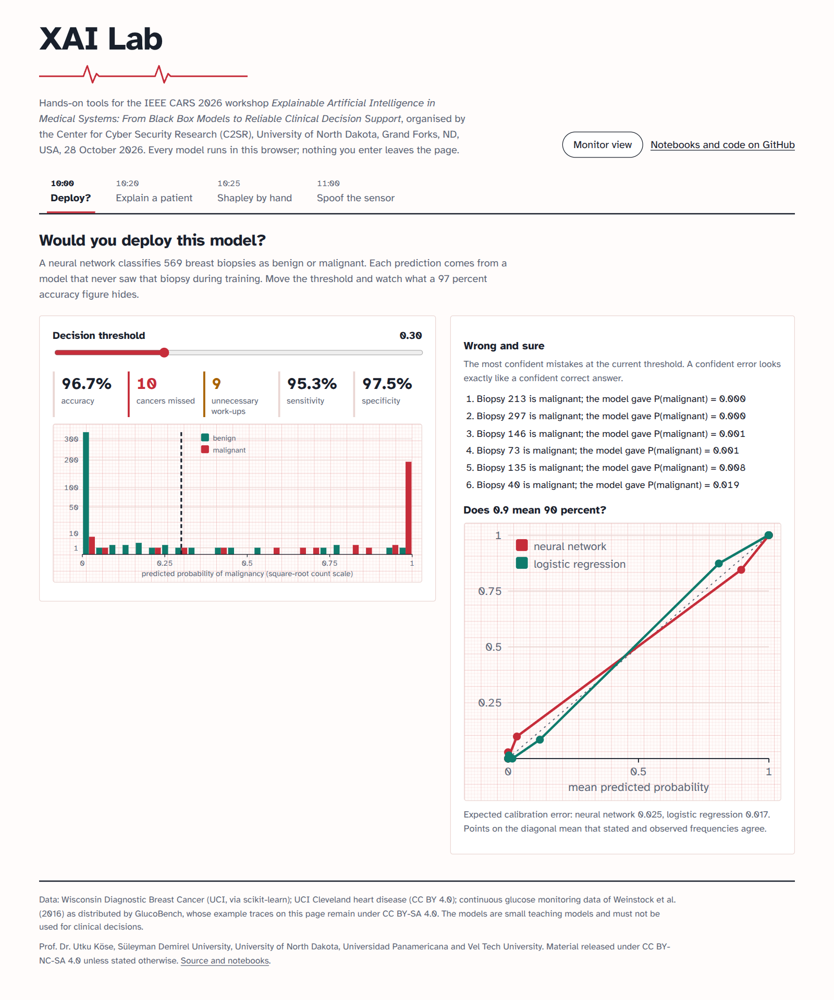</a></td>
<td width="50%"><a href="https://utkukose.github.io/xai-cars2026-NB-workshop/#explain">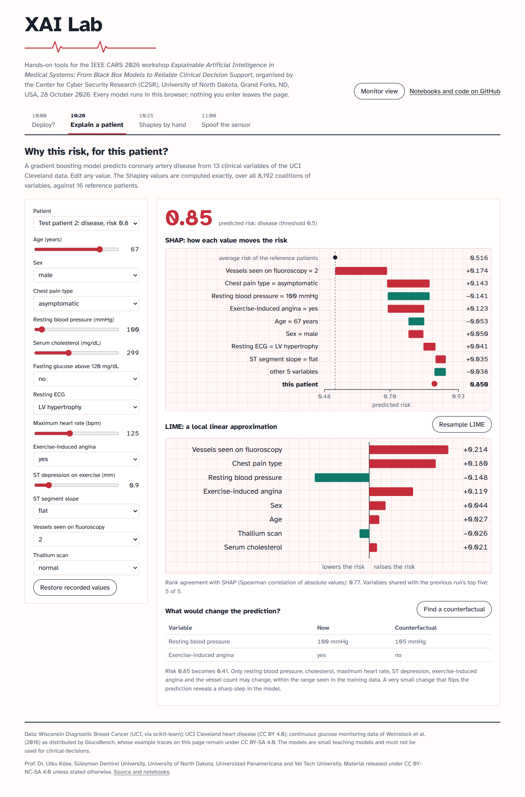</a></td>
</tr>
<tr>
<td><sub><em>Deploy?</em> The threshold slider turns a 97 percent accuracy figure into missed cancers, unnecessary work-ups and confident errors.</sub></td>
<td><sub><em>Explain a patient.</em> Exact Shapley values over all 8,192 coalitions, repeated LIME runs and a constrained counterfactual.</sub></td>
</tr>
<tr>
<td width="50%"><a href="https://utkukose.github.io/xai-cars2026-NB-workshop/#shapley">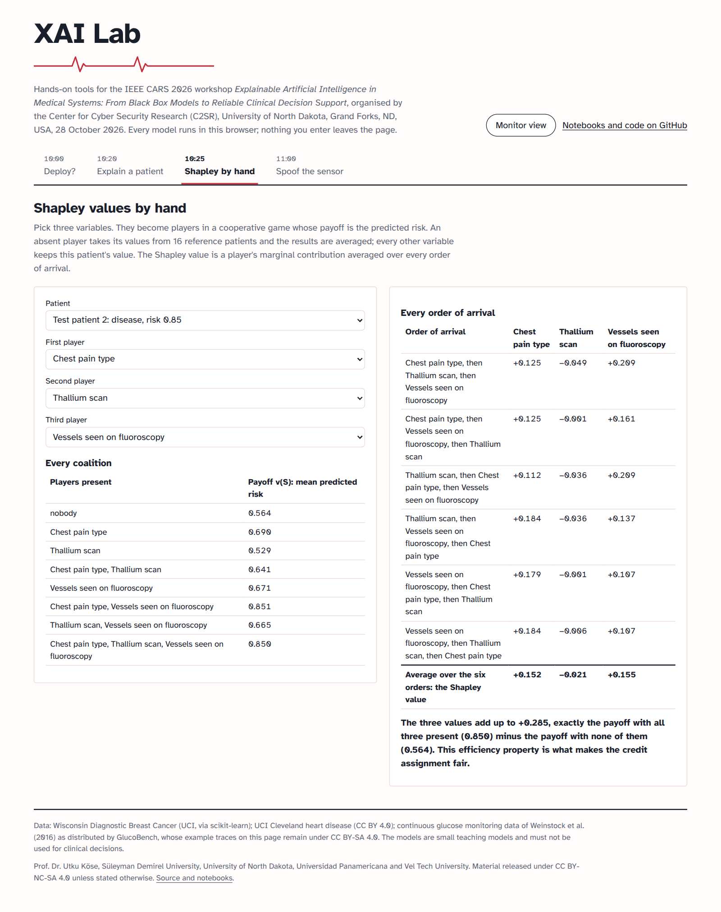</a></td>
<td width="50%"><a href="https://utkukose.github.io/xai-cars2026-NB-workshop/#spoof">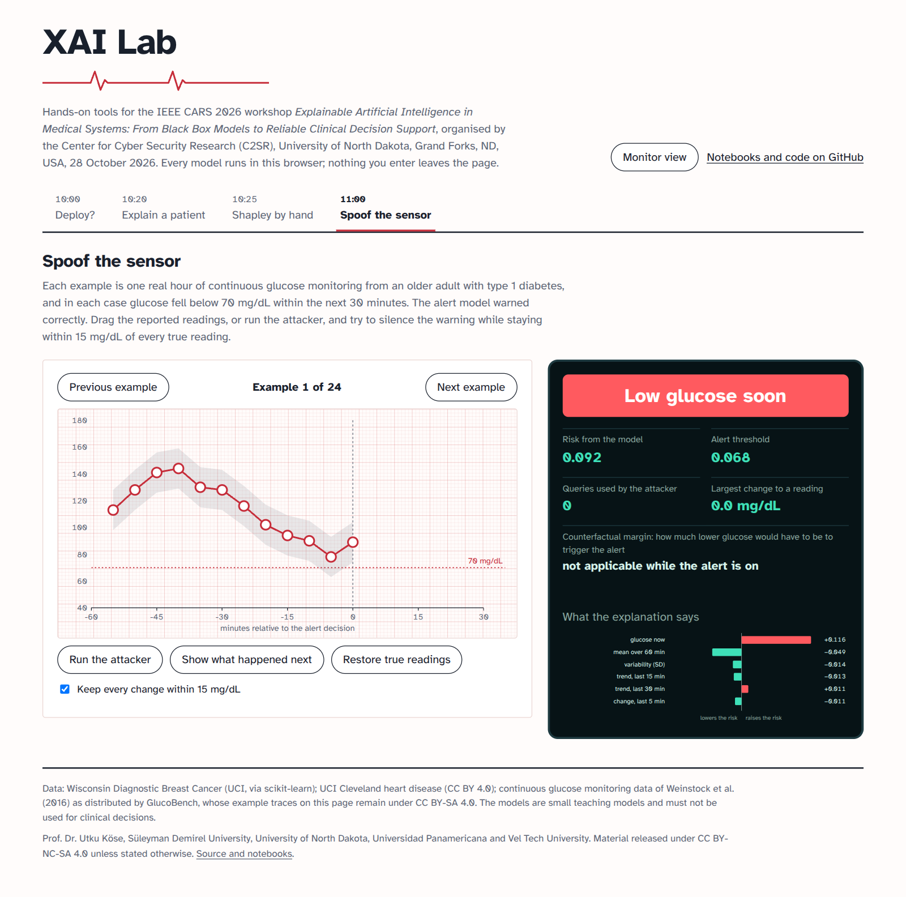</a></td>
</tr>
<tr>
<td><sub><em>Shapley by hand.</em> Every coalition and every order of arrival of three chosen variables, with the efficiency check.</sub></td>
<td><sub><em>Spoof the sensor</em>, before the attack: the alert model warns correctly about a coming low.</sub></td>
</tr>
</table>

### The notebooks

<table>
<tr>
<td width="50%">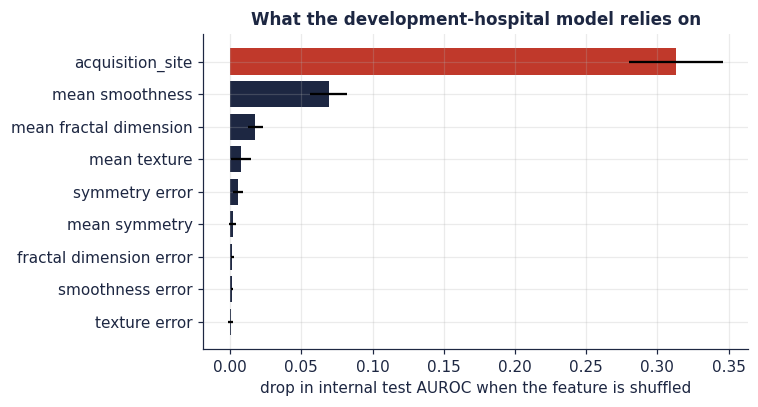</td>
<td width="50%">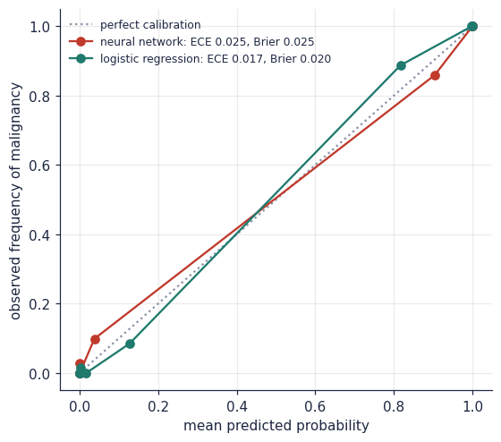</td>
</tr>
<tr>
<td><sub>NB1: a model that learned the hospital instead of the disease.</sub></td>
<td><sub>NB1: does a probability of 0.9 mean 90 percent?</sub></td>
</tr>
<tr>
<td width="50%">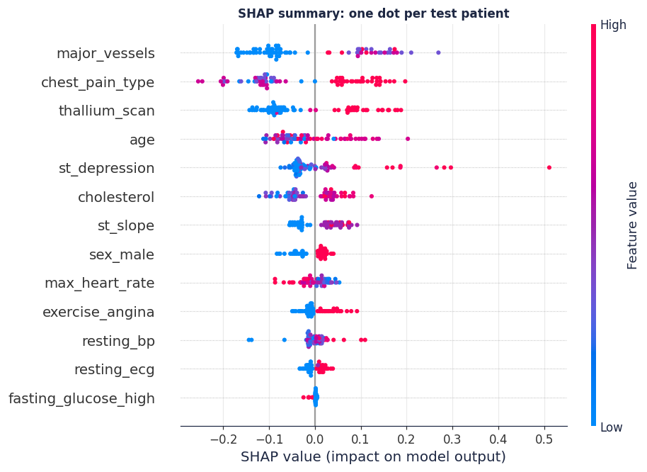</td>
<td width="50%">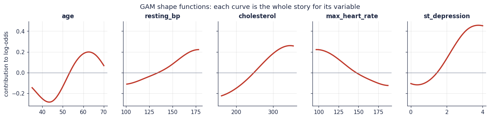</td>
</tr>
<tr>
<td><sub>NB2: SHAP summary of the gradient boosting model.</sub></td>
<td><sub>NB2: in a GAM, each curve is the whole story for its variable.</sub></td>
</tr>
<tr>
<td width="50%">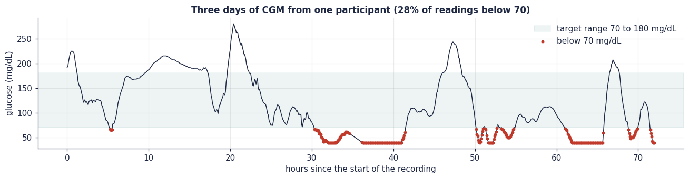</td>
<td width="50%">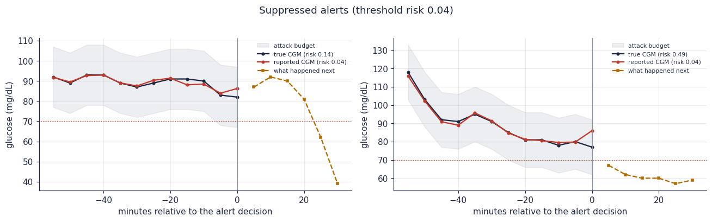</td>
</tr>
<tr>
<td><sub>NB4: three days of real CGM data from one participant.</sub></td>
<td><sub>NB4: readings nudged within 15 mg/dL silence correct alerts before real lows.</sub></td>
</tr>
<tr>
<td width="50%">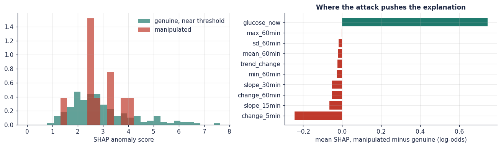</td>
<td width="50%">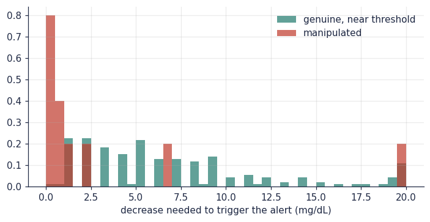</td>
</tr>
<tr>
<td><sub>NB4: where the attack pushes the explanation.</sub></td>
<td><sub>NB4: manipulated windows sit much closer to the alert boundary.</sub></td>
</tr>
<tr>
<td width="50%">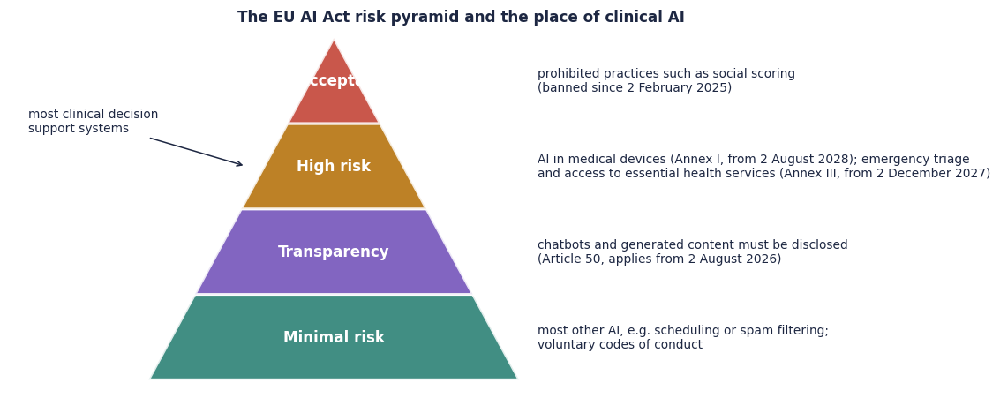</td>
<td width="50%">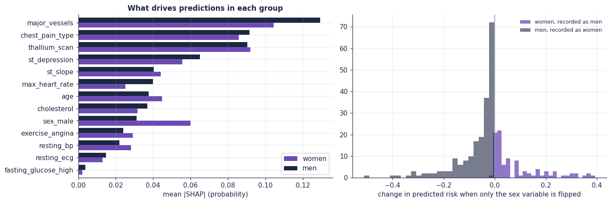</td>
</tr>
<tr>
<td><sub>NB7: the place of clinical AI under the EU AI Act.</sub></td>
<td><sub>NB7: what drives predictions for women and men, and what flipping only the sex variable does.</sub></td>
</tr>
</table>

## XAI Lab

The [XAI Lab](https://utkukose.github.io/xai-cars2026-NB-workshop/) is a single web page in `docs/` that participants open during the session. All models run in the browser, and no data leave the page. Each tab can be linked directly, for example [#spoof](https://utkukose.github.io/xai-cars2026-NB-workshop/#spoof).

| Tab | Purpose |
|---|---|
| *Deploy?* | Out-of-fold predictions of the NB1 network: move the threshold, count missed cancers, inspect confident errors and calibration. |
| *Explain a patient* | The NB2 gradient boosting model with exact Shapley values over all 8,192 coalitions, repeated LIME runs and a constrained counterfactual search. |
| *Shapley by hand* | A three-player game built from any patient and any three variables, with every coalition and every order of arrival. |
| *Spoof the sensor* | Real CGM hours that preceded hypoglycaemia; drag the readings or run a decision-based attacker, then watch the counterfactual margin and the explanation. |

The models and data excerpts in `docs/lab-data.js` are produced by `tools/build_lab_models.py`. The JavaScript implementation reproduces the scikit-learn predictions and the Python Shapley values to within floating point rounding. To publish the page, enable GitHub Pages in the repository settings with the source *Deploy from a branch*, branch `main`, folder `/docs`.

## Dashboard

The Streamlit dashboard shows a patient's predicted risk with its SHAP explanation, a what-if panel with a counterfactual search, the population view, a subgroup audit with bootstrap intervals and a downloadable model card.

```bash
pip install -r requirements.txt
streamlit run dashboard/app.py
```

## Data

| Dataset | Used in | Source | Licence |
|---|---|---|---|
| Wisconsin Diagnostic Breast Cancer | NB1, Lab | bundled with scikit-learn (UCI) | CC BY 4.0 |
| UCI Cleveland heart disease | NB2, NB7, Lab, dashboard | UCI Machine Learning Repository | CC BY 4.0 |
| PneumoniaMNIST, 64 × 64 (MedMNIST v2) | NB3 | Zenodo record 10519652 | CC BY 4.0 |
| Weinstock et al. (2016) CGM data of older adults with type 1 diabetes | NB4, Lab | GlucoBench repository, pinned commit | CC BY-SA 4.0, as listed by GlucoBench |
| PhysioNet/Computing in Cardiology Challenge 2019, training set A | NB5 | PhysioNet open data | CC BY 4.0 |
| MIT-BIH Atrial Fibrillation Database (annotations only) | NB6 | PhysioNet open data | Open Data Commons Attribution 1.0 |

The notebooks download the data at run time and verify checksums where a published value exists. The only data excerpts stored in this repository are the example CGM traces in `docs/lab-data.js`, which remain under CC BY-SA 4.0.

## Getting started

**Colab.** Click one of the orange buttons above. Nothing else is needed.

**Local installation.**

```bash
git clone https://github.com/utkukose/xai-cars2026-NB-workshop.git
cd xai-cars2026-NB-workshop
python -m venv .venv && source .venv/bin/activate
pip install torch --index-url https://download.pytorch.org/whl/cpu
pip install -r requirements.txt
jupyter lab notebooks/
```

**Quick mode.** Setting the environment variable `XAI_WORKSHOP_QUICK=1` shrinks sample sizes and iteration counts so that every notebook finishes in about a minute. The automated check uses it:

```bash
python tools/run_notebooks.py --quick
```

**Renaming the repository.** If the repository is forked or renamed, `python tools/set_repo_name.py NEW_NAME --owner NEW_OWNER` updates every Colab button, the GitHub Pages address and the citation files.

## Repository structure

```
xai-cars2026-NB-workshop/
├── notebooks/                 seven workshop notebooks (NB1 to NB7)
├── docs/                      XAI Lab for GitHub Pages
│   ├── index.html             page and styles
│   ├── lab-core.js            models, Shapley values, LIME, counterfactuals, attack
│   ├── lab-ui.js              user interface
│   ├── lab-data.js            generated models and data excerpts
│   └── images/                screenshots and figures used in this README
├── dashboard/app.py           Streamlit dashboard
├── tools/
│   ├── build_lab_models.py    trains and exports the lab models
│   ├── run_notebooks.py       executes all notebooks
│   └── set_repo_name.py       updates links after a rename
├── .github/workflows/         automated notebook check
├── WORKSHOP_GUIDE.md          session plan, polls and fallback plan
├── REFERENCES.md              consolidated references
├── CITATION.cff
├── requirements.txt
└── LICENSE
```

## Design principles

The workshop uses real, openly accessible data throughout, so that every number shown in the session can be reproduced by any participant. Claims about explanations as a defence are kept to what the evidence supports: the notebooks report how well each explanation-based signal separates manipulated from genuine inputs, including the cases where a signal is weak. Random seeds, a pinned data commit and published checksums make the runs repeatable. The notebooks are written for teaching, and every section can be read as a lecture note without running the code.

## Related material

The graduate course *Explainable AI in Healthcare* at Universidad Panamericana develops the same themes over 23 notebooks in six modules: [xai-healthcare-NB-lecture](https://github.com/utkukose/xai-healthcare-NB-lecture). GEMEX, the geometric explainer used in NB2 and in the attack notebooks, is available on [PyPI](https://pypi.org/project/gemex/). All references are collected in [REFERENCES.md](REFERENCES.md).

## Citation

```bibtex
@misc{kose2026xaicars,
  author       = {K{\"o}se, Utku},
  title        = {Explainable Artificial Intelligence in Medical Systems: From Black Box Models
                  to Reliable Clinical Decision Support},
  howpublished = {Workshop materials, IEEE Cyber Awareness and Research Symposium (IEEE CARS 2026),
                  Center for Cyber Security Research (C2SR), University of North Dakota},
  address      = {Grand Forks, ND, USA},
  year         = {2026},
  month        = oct,
  url          = {https://github.com/utkukose/xai-cars2026-NB-workshop}
}
```

## License

The notebooks, the XAI Lab, the dashboard and all text in this repository are released under the [Creative Commons Attribution-NonCommercial-ShareAlike 4.0 International License](https://creativecommons.org/licenses/by-nc-sa/4.0/). Third-party datasets keep their own licences, listed in the data table above; in particular, the CGM example traces in `docs/lab-data.js` remain under CC BY-SA 4.0. Third-party software is used under its respective licence. See [LICENSE](LICENSE).

## Acknowledgements

The author thanks the Center for Cyber Security Research (C2SR) of the University of North Dakota for organising IEEE CARS 2026, in particular the General Chair and C2SR Director, Dr. Prakash Ranganathan, and the workshop contact, Sriram Prabhakara Rao. The workshop relies on openly shared data from the UCI Machine Learning Repository, the MedMNIST team, PhysioNet and the Computing in Cardiology Challenge, the study group of Weinstock et al. and the GlucoBench authors, and on the maintainers of scikit-learn, SHAP, LIME, InterpretML, PyTorch, wfdb and Streamlit.

---

<div align="center">

**Prof. Dr. Utku Köse**<br>
Süleyman Demirel University · University of North Dakota · Universidad Panamericana · Vel Tech University<br>
[utkukose.com](https://www.utkukose.com) · [ORCID 0000-0002-9652-6415](https://orcid.org/0000-0002-9652-6415) · [github.com/utkukose](https://github.com/utkukose)

<sub>IEEE CARS 2026 · Center for Cyber Security Research (C2SR), University of North Dakota · Grand Forks, ND, USA · 28 October 2026</sub>

</div>
